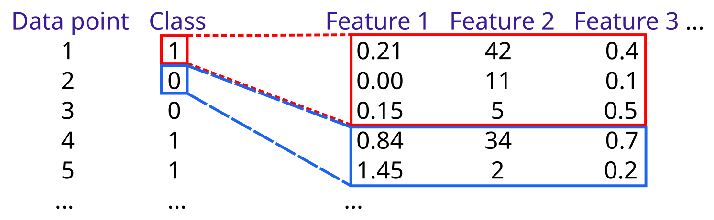
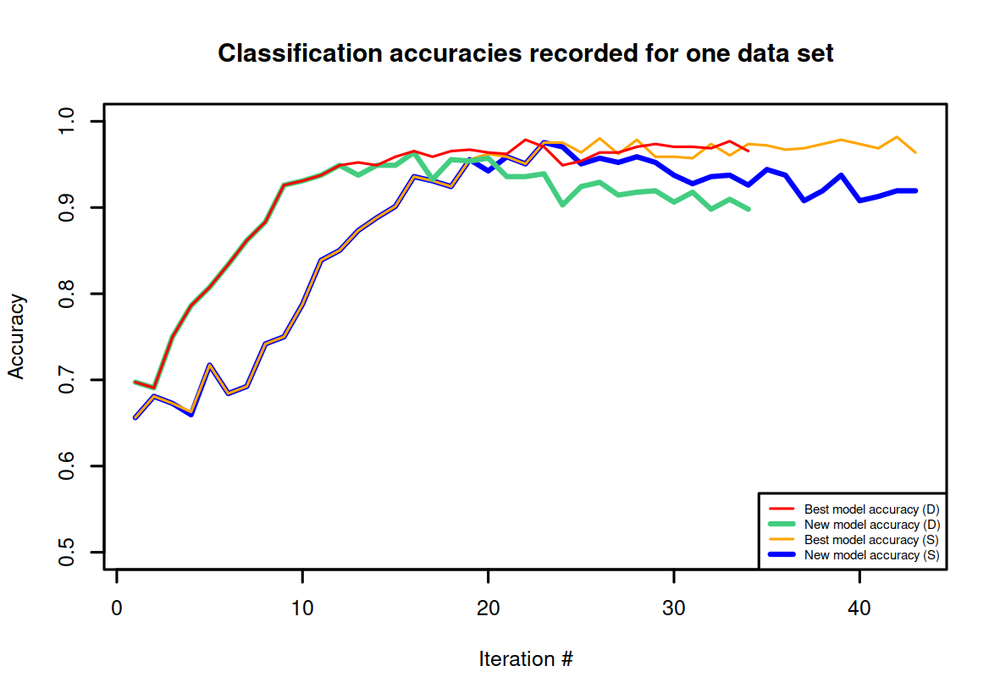

# Training with multiple feature vectors per data point

A proof-of-concept Python implementation of training a classifier for data points with known
class labels and multiple associated feature vectors. One feature vector per data point needs to be selected for
training as part of the process. The learning problem is depicted in the following figure.



## Method

The method starts out from feature vectors that are randomly sampled from the set of feature vectors for each data point
of a training set and trains an initial classification model ([random forest](https://en.wikipedia.org/wiki/Random_forest)). 
The initial model selects feature vectors for data points of a held-out subset of data points that were not used for training. 
This hold-out set also serves as a test set to calculate accuracy and other classification performance parameters.
The procedure then exchanges data points of the training set with data points of test the set for which feature vectors have been selected.
The next model is trained with the updated set of data points.
During the process the model with best classification accuracy on the held-out set is kept and its accuracy is compared to new models trained
on updated training sets. In each iteration the better model, i.e. either the new classifier or the best one kept in a previous iteration,
is applied to select feature vectors in the held-out set which are then incorporated in the next training set.

## Implementation

### SQLite database

The current implementation fetches data points from an SQLite file database. The database has two tables, _label_ and _feature_vector_.
The table _label_ is created by the following statement. Only the _label_no_ column is **not** required. The _label_num_ column contains
integer values identifying data points and the _label_value_ column contains the class labels (0 or 1).

```SQL
CREATE TABLE label (
    label_no INTEGER PRIMARY KEY ASC,
    label_num INTEGER NOT NULL UNIQUE,
    label_value INTEGER NOT NULL)
```

The table _feature_vector_ requires the columns _feature_vector_no_, _label_num_ and _feature_vector_num_, which need to
be the first table columns, as well as one or more columns with feature values whose names and types can be freely chosen.

```SQL
CREATE TABLE feature_vector (
    feature_vector_no INTEGER PRIMARY KEY ASC,
    label_num INTEGER NOT NULL,
    feature_vector_num INTEGER NOT NULL,
    feature_1 REAL NOT NULL,
    feature_2 REAL NOT NULL
    --, feature_3 ..., feature_4 ...
)
```

Values in the _label_num_ column correspond to _label_num_ values in the _label_ table. The _feature_vector_num_ column
contains integers identifying feature vectors associated with a data point.
Currently, the _feature_vector_no_ column is mainly needed to obtain column names. By default it is expected to contain
an entry with _feature_vector_no_ = 1 (see `db.Database.get_feature_columns`).
To extract feature vectors the program needs to be configured with the 0-based index of the first feature column.
This is by default 3. When used as a library, the parameter can be set in the class variable `train.MultiVectorTrainer.featureStart`.

### Feature vector selection

By default the procedure selects the _best_ feature vector for a test set data point with highest probability P(class=1|features) 
(as returned by scikit model method `predict_proba`). For the purpose of comparison I also implemented a stochastic feature vector
selection strategy.

Let the probability of class label = 1 of feature vector i of a data point be denoted as p<sub>i</sub>.

<!--
\begin{equation}
p_i = P(label=1|x_i),\;i = 1 ... N
\end{equation}
-->


And p<sub>max</sub> be the high probability value for feature vectors of a data point.

<!--
\begin{equation}
p_{max} = argmax(p_i),\;i = 1 ... N
\end{equation}
-->


The p<sub>i</sub> are scaled with the following exponential function.

<!--
\begin{equation}
z_i = e^{\left( p_i - p_{max} \right) \cdot f(t)}
\end{equation}
-->


The scaling function _f(t)_ depends on the iteration number _t_ (s.b.). As a result z<sub>max</sub> &#61; 1 and 0 &lt; z<sub>i</sub> &lt; 1.
The stochastic selection process samples p<sub>i</sub> from the categorical distribution normalized by the sum of scaled 
probabilities.

<!--
\begin{equation}
P(z_i) = \frac{z_i}{\sum_{k}z_k},\;i, k = 1...N
\end{equation}
-->


The default scaling function is the square of the iteration number minus 1 multiplied by a scaling factor, so that
with increasing iteration number the stochastic process tends more and more to sampling vectors with high probability
values and the resulting categorical distribution is uniform in the first iteration.

<!--
\begin{equation}
f(t) = c \cdot \left(t - 1\right)^2,\;t \in \mathbb{N}^+
\end{equation}
-->


Via commandline, stochastic selection with the described default function can be invoked with options _-s_ or _--selectdist_.
When used as a library, the boolean `db.MultiVectorTrainer.selectBest` switches between deterministic and stochastic
vector selection, the scale factor _c_ of the default scaling function can be set in the variable `db.MultiVectorTrainer.scaleFactor`,
and a customized scale function can be specified to the `db.MultiVectorTrainer.train` function in the `get_scale` argument.

### Commandline

A commandline help text is shown when invoking the training program with _-h_ or _--help_.

```bash
python3 mvt train -h
# usage: train [-h] -d DATABASE -m MODELFILE [-t TRACEFILE] [-i MAXITERATIONS] [-n MAXUNIMPROVED] [-s]
#
# Train ML model selecting from multiple feature vectors per data point
# 
# optional arguments:
#   -h, --help            show this help message and exit
#   -d DATABASE, --data DATABASE
#                         Input SQLite database
#   -m MODELFILE, --model MODELFILE
#                        Output model file
#   -t TRACEFILE, --trace TRACEFILE
#                         Output file for iteration info
#   -i MAXITERATIONS, --iterations MAXITERATIONS
#                         Maximum number of iterations
#   -n MAXUNIMPROVED, --maxUnimproved MAXUNIMPROVED
#                         Maximum number of iterations without improvement
#   -s, --selectdist      Sample feature vectors from the distribution of vector probabilities for positioning
```

## Example

The following plot shows classification accuracies obtained with deterministic (D) and stochastic (S) feature vector selection.



Example data to follow.
